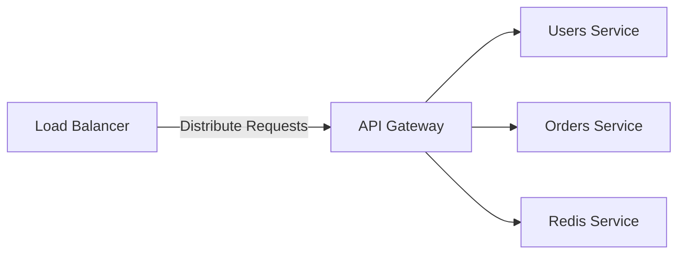

# Scalable Microservices Architecture with API Gateway and Nginx

## Project Overview

This project demonstrates a **scalable architecture** using the **API Gateway** pattern and **microservices**. It utilizes **Nginx** as a **load balancer** to distribute incoming traffic across multiple instances of the `gateway` service. The setup includes different services such as `users`, `orders`, and a `redis` service, with `gateway` acting as the central point for routing and load balancing. 

The architecture ensures scalability and fault tolerance by enabling the horizontal scaling of services like `gateway` and utilizing the load balancing capabilities of Nginx. Each service is isolated in its container and communicates over an internal network, ensuring flexibility and ease of maintenance.

## Diagram

This diagram visualizes how the components interact, with Nginx serving as the load balancer to distribute requests among the `gateway` service, which then forwards requests to the appropriate microservice (`users`, `orders`, `redis`).

## Key Features
- **Scalability**: Horizontal scaling of `gateway` service using Docker Compose.
- **Microservices**: Individual services for users, orders, and Redis with isolated containers.
- **Load Balancing**: Nginx as a reverse proxy to balance requests between multiple `gateway` instances.
- **API Gateway Pattern**: Centralized routing and control over service interactions through the `gateway`.

## How It Works
1. **Client** sends an HTTP request to the API Gateway.
2. The **API Gateway** (via Nginx load balancer) routes the request to the appropriate microservice (e.g., `users`, `orders`).
3. Each service (e.g., `users`, `orders`) runs in its own Docker container, providing isolation and easier scaling.
4. **Nginx** ensures that requests are distributed across multiple instances of the `gateway` service for load balancing.

---

This architecture ensures robust, scalable, and maintainable microservices communication, with Nginx providing load balancing and fault tolerance.
